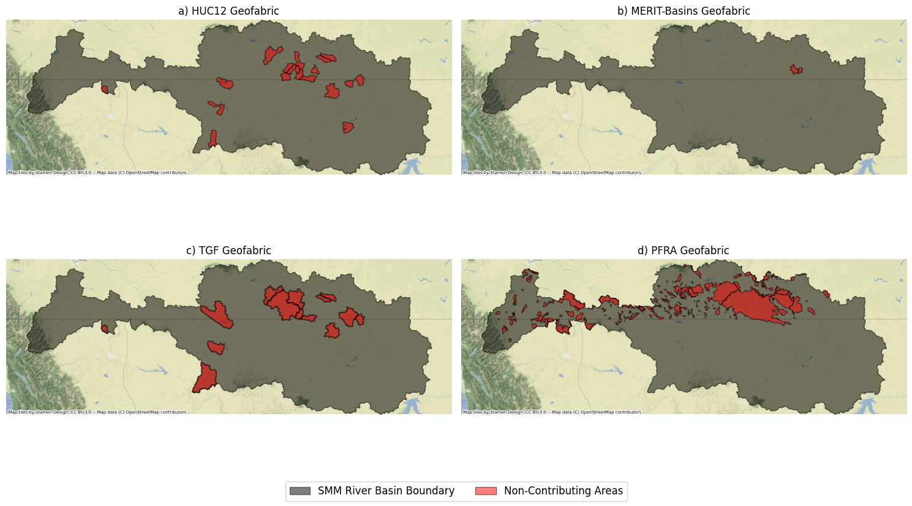

# Workflow of the Analysis
The workflow of the analysis could be viewed in the relevant Jupyter Notebook located in [geofabric_analysis.ipynb](./geofabric_analysis.ipynb).

# Summary of the Analysis
## Non-contributing Areas of each Geofabric Dataset
Non-Contributing Areas of each Geofabric dataset in $km^{2}$:

|#    |Geofabric      |Non-Contributing Areas ($km^{2}$)|
|:---:|:--------------|:-------------------------------:|
|1    |`HUC12`        |2496.44			        |
|2    |`TGF`          |4706.36				|
|3    |`MERIT-Basins` |110.19±20			|
|4    |`PFRA`         |6743.34				|

**NOTE**: Since there is hole in the MERIT-Basins sub-basin polygons that was not delineated, an area of ±20 $km^{2}$ should be considered for the MERIT-Basins Non-contributing Areas.

## Shared Non-Contributing Areas between Pairs of Geofabric Datasets
The Non-Contributing Areas shared between pairs of Geofabric Datasets (in $km^{2}$):

|Datasets	|HUC12		|TGF		|MERIT-Basins		|PFRA		|
|:-------------:|:-------------:|:-------------:|:---------------------:|:-------------:|
|HUC12		|NA		|2244.07	|0.0			|1227.98	|
|TGF		|2244.07	|NA		|0.73			|2129.43	|
|MERIT-Basins	|0.0		|0.73		|NA			|109.01		|
|PFRA		|1227.98	|2129.43	|109.01			|NA		|

## Visual Overview of the Non-contributing Areas of each Geofabric Dataset

